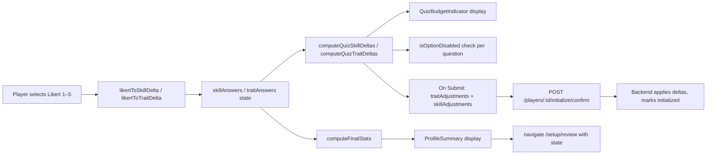

# Design Document: Personality Quiz Profile Setup

## Overview

This feature replaces the slider-based manual adjustment step in `ProfileSetupPage` with a two-part personality quiz. Players answer Likert-scale questions about their skills and traits; their answers are mapped to internal deltas that are applied on top of randomly rolled base values to produce the player's starting stats.

The quiz is embedded inside the existing `ProfileSetupPage` at `/setup/profile`. No routing changes are required. The slider components (`TraitSliderRow`, `SkillSliderRow`, `BudgetMeter`) are removed from `ProfileSetupPage` and replaced by a `QuizPage` component that manages the full quiz flow: Skills → Traits → Summary.

### Key Design Decisions

- **Same API endpoints, same shapes**: `POST /players/:id/initialize` and `POST /players/:id/initialize/confirm` are called with identical request/response shapes. No backend changes are needed.
- **New budget constants**: The quiz uses `Skills_Budget = 34` and `Traits_Budget = 89` (not the old slider budgets of 10 and 50). New constants are added to `constants.ts`; the old slider constants remain for backward compatibility until the slider components are deleted.
- **New delta mapping functions**: Likert → delta conversion is a pure function extracted to `quizUtils.ts` so it can be property-tested independently.
- **Component state only**: Quiz answers live in React component state inside `QuizPage`. Nothing is persisted to the backend until the player submits.
- **Budget enforcement via disabled options**: Rather than clamping after selection, individual Likert options that would push the budget over the limit are rendered as disabled before the player can click them.
- **Unanswered question marking**: Attempting to advance/submit with incomplete answers marks unanswered questions visually (error border) without blocking the UI.
- **Bookmarks panel preserved**: `ProfileSetupPage` continues to render `BookmarkedJobsPanel` and `BookmarkedProgramsPanel`. These panels receive `currentTraits` and `currentSkills` computed from `rolledPlayer` base values plus quiz deltas.

---

## Architecture

### Component Tree

```
ProfileSetupPage  (/setup/profile)
├── [Pre-roll state]  →  "Generate My Profile" button
├── [Loading state]   →  CircularProgress + Reload button
└── [Post-roll state]
    ├── Header (title + error alert)
    └── 2-column layout
        ├── Left: QuizPage
        │   ├── [step === 'skills']  →  SkillsQuiz
        │   │   ├── QuizBudgetIndicator (skills)
        │   │   ├── LikertQuestion × 8  (one per skill)
        │   │   └── Next button
        │   ├── [step === 'traits']  →  TraitsQuiz
        │   │   ├── QuizBudgetIndicator (traits)
        │   │   ├── LikertQuestion × 13  (one per trait)
        │   │   ├── Back button
        │   │   └── Submit button
        │   └── [step === 'summary']  →  ProfileSummary
        │       ├── Trait stat list (13 rows)
        │       ├── Skill stat list (8 rows)
        │       └── "Proceed to Review" button
        └── Right: BookmarkedJobsPanel + BookmarkedProgramsPanel
```

### Data Flow: Quiz Answer → Delta → Final Stat



### State Ownership

| State | Owner | Lifetime |
|---|---|---|
| `rolledPlayer` | `ProfileSetupPage` | Until page unmount |
| `skillAnswers: Record<string, number>` | `QuizPage` | Until page unmount |
| `traitAnswers: Record<string, number>` | `QuizPage` | Until page unmount |
| `quizStep: 'skills' \| 'traits' \| 'summary'` | `QuizPage` | Until page unmount |
| `showUnanswered: boolean` | `QuizPage` | Reset on step change |
| `submitError: string \| null` | `QuizPage` | Until next submit attempt |
| `hasRolledProfile` | Redux `authSlice` | Session |

---

## Components and Interfaces

### New Components

#### `QuizPage`

**File:** `frontend/src/features/profile/quiz/QuizPage.tsx`

**Responsibilities:**
- Owns all quiz state: `skillAnswers`, `traitAnswers`, `quizStep`, `showUnanswered`, `submitError`
- Renders `SkillsQuiz`, `TraitsQuiz`, or `ProfileSummary` based on `quizStep`
- Handles the "Next" transition (validates all 8 skills answered)
- Handles the "Back" transition (returns to skills step, preserves all answers)
- Handles the "Submit" transition (validates all 13 traits answered, calls confirm endpoint)
- Computes `currentTraits` and `currentSkills` (base + quiz deltas) and passes them up to `ProfileSetupPage` via `onStatsChange` callback for the bookmarks panel
- Calls `onConfirmSuccess` callback when confirm endpoint succeeds

**Props:**
```typescript
interface QuizPageProps {
  rolledPlayer: RolledPlayerData;
  playerId: string;
  onConfirmSuccess: () => void;
  onStatsChange: (traits: Record<string, number>, skills: Record<string, number>) => void;
}
```

**Key internal logic:**
```typescript
type QuizStep = 'skills' | 'traits' | 'summary';

const [skillAnswers, setSkillAnswers] = useState<Record<string, number>>({});
const [traitAnswers, setTraitAnswers] = useState<Record<string, number>>({});
const [quizStep, setQuizStep] = useState<QuizStep>('skills');
const [showUnanswered, setShowUnanswered] = useState(false);
const [submitError, setSubmitError] = useState<string | null>(null);

const skillDeltas = computeQuizSkillDeltas(skillAnswers);   // from quizUtils
const traitDeltas = computeQuizTraitDeltas(traitAnswers);   // from quizUtils
```

---

#### `SkillsQuiz`

**File:** `frontend/src/features/profile/quiz/SkillsQuiz.tsx`

**Responsibilities:**
- Renders one `LikertQuestion` per skill (8 total) using `SKILL_LABELS`
- Renders `QuizBudgetIndicator` for the skills budget
- Renders "Next" button (enabled only when all 8 skills have an answer)
- When `showUnanswered` is true, passes `hasError` to unanswered `LikertQuestion` rows

**Props:**
```typescript
interface SkillsQuizProps {
  answers: Record<string, number>;           // skillKey → Likert value (1–5)
  onAnswerChange: (key: string, value: number) => void;
  onNext: () => void;
  showUnanswered: boolean;
}
```

**Budget computation (inline):**
```typescript
const deltas = computeQuizSkillDeltas(answers);
const spent = Object.values(deltas).reduce((s, v) => s + v, 0);
const remaining = QUIZ_SKILLS_BUDGET - spent;
```

---

#### `TraitsQuiz`

**File:** `frontend/src/features/profile/quiz/TraitsQuiz.tsx`

**Responsibilities:**
- Renders one `LikertQuestion` per trait (13 total) using `TRAIT_LABELS`
- Renders `QuizBudgetIndicator` for the traits budget
- Renders "Back" button and "Submit" button
- "Submit" enabled only when all 13 traits have an answer
- When `showUnanswered` is true, passes `hasError` to unanswered `LikertQuestion` rows
- Shows `submitError` as an `Alert` above the Submit button when present

**Props:**
```typescript
interface TraitsQuizProps {
  answers: Record<string, number>;           // traitKey → Likert value (1–5)
  onAnswerChange: (key: string, value: number) => void;
  onBack: () => void;
  onSubmit: () => void;
  showUnanswered: boolean;
  submitError: string | null;
  isSubmitting: boolean;
}
```

---

#### `LikertQuestion`

**File:** `frontend/src/features/profile/quiz/LikertQuestion.tsx`

**Responsibilities:**
- Renders a single question row: prompt text + 5 selectable option buttons
- Highlights the currently selected option
- Disables individual options that are passed in `disabledOptions`
- Shows an error border/highlight when `hasError` is true and no option is selected
- Accessible: each option button has `aria-label` including the option value and label

**Props:**
```typescript
interface LikertQuestionProps {
  questionKey: string;                       // skill or trait key
  prompt: string;                            // "I enjoy Math" / "I am Brave"
  selectedValue: number | undefined;         // currently selected Likert value (1–5) or undefined
  onSelect: (key: string, value: number) => void;
  disabledOptions: Set<number>;              // Likert values (1–5) that are disabled
  hasError: boolean;                         // true when showUnanswered and no answer selected
}
```

**Option labels:**
```typescript
const LIKERT_LABELS: Record<number, string> = {
  1: 'Strongly Disagree',
  2: 'Disagree',
  3: 'Neutral',
  4: 'Agree',
  5: 'Strongly Agree',
};
```

**Rendering:** Five MUI `Button` components in a row (or `ToggleButtonGroup` for accessibility). Each button shows its numeric value (1–5) with a tooltip or visible label for the text description.

---

#### `QuizBudgetIndicator`

**File:** `frontend/src/features/profile/quiz/QuizBudgetIndicator.tsx`

**Responsibilities:**
- Displays spent / total / remaining budget values
- Renders a `LinearProgress` bar showing percentage used
- Enters warning state (red color, warning icon) when `remaining <= 0`
- Distinct from the old `BudgetMeter` — uses quiz-specific budget totals and does not show "%" units (quiz budget is in delta points, not percentages)

**Props:**
```typescript
interface QuizBudgetIndicatorProps {
  label: string;          // "Skills Budget" or "Traits Budget"
  total: number;          // 34 or 89
  spent: number;          // sum of selected deltas
  remaining: number;      // total - spent (may be negative)
}
```

**Warning state:** `remaining <= 0` → progress bar turns `error.main`, remaining value shown in red, warning icon displayed.

---

#### `ProfileSummary`

**File:** `frontend/src/features/profile/quiz/ProfileSummary.tsx`

**Responsibilities:**
- Displays all 13 trait final stats (base + trait delta, clamped to [0, 100])
- Displays all 8 skill final stats (base + skill delta, clamped to [0, 10])
- Read-only — no inputs, sliders, or editable controls
- Renders "Proceed to Review" button that calls `onProceed`

**Props:**
```typescript
interface ProfileSummaryProps {
  rolledPlayer: RolledPlayerData;
  skillDeltas: Record<string, number>;       // computed from quiz answers
  traitDeltas: Record<string, number>;       // computed from quiz answers
  onProceed: () => void;
}
```

**Final stat computation (inline):**
```typescript
const finalTraits = Object.fromEntries(
  Object.entries(rolledPlayer.traits).map(([k, v]) => [
    k,
    Math.max(0, Math.min(100, v + (traitDeltas[k] ?? 0))),
  ])
);
const finalSkills = Object.fromEntries(
  Object.entries(rolledPlayer.skills).map(([k, v]) => [
    k,
    Math.max(0, Math.min(10, v + (skillDeltas[k] ?? 0))),
  ])
);
```

---

### Modified Components

#### `ProfileSetupPage`

**File:** `frontend/src/pages/ProfileSetupPage.tsx`

**Changes:**
1. Remove imports: `TraitSliderRow`, `SkillSliderRow`, `BudgetMeter`, `clampTraitDelta`, `clampSkillDelta`, `computeTraitBudget`, `computeSkillBudget`, `TRAIT_LABELS`, `SKILL_LABELS`
2. Remove state: `traitDeltas`, `skillDeltas`, `sliderResetKey`
3. Remove handlers: `handleTraitChange`, `handleSkillChange`, `handleReset`
4. Remove budget computation block
5. Add state: `currentTraits`, `currentSkills` (updated via `QuizPage.onStatsChange` callback)
6. Replace the entire "Adjust state" JSX section with `<QuizPage>` and the bookmarks column
7. `handleProceedToReview` is now called from `QuizPage.onConfirmSuccess` — `ProfileSetupPage` navigates to `/setup/review` passing `rolledPlayer` and the final deltas received from `QuizPage`

**Updated layout (post-roll):**
```tsx
<Box sx={{ display: 'grid', gridTemplateColumns: { xs: '1fr', md: '2fr 1fr' }, gap: 3 }}>
  {/* Left: Quiz (takes 2/3 width) */}
  <QuizPage
    rolledPlayer={rolledPlayer}
    playerId={playerId}
    onConfirmSuccess={handleConfirmSuccess}
    onStatsChange={(traits, skills) => {
      setCurrentTraits(traits);
      setCurrentSkills(skills);
    }}
  />
  {/* Right: Bookmarks (takes 1/3 width) */}
  <Box>
    <Typography variant="h6" fontWeight={700} sx={{ mb: 2 }}>Your Bookmarks</Typography>
    <BookmarkedJobsPanel currentTraits={currentTraits} currentSkills={currentSkills} />
    <Divider sx={{ my: 2 }} />
    <BookmarkedProgramsPanel currentTraits={currentTraits} currentSkills={currentSkills} />
  </Box>
</Box>
```

**`handleConfirmSuccess`:** Navigates to `/setup/review` with `{ rolledPlayer, traitDeltas, skillDeltas }` in router state (deltas received from `QuizPage` via a ref or callback parameter).

---

### New Utility Module

#### `quizUtils.ts`

**File:** `frontend/src/features/profile/quiz/quizUtils.ts`

**Exports:**

```typescript
// Likert value → Skill_Delta mapping
// 1→−2, 2→−1, 3→0, 4→+1, 5→+2
export function likertToSkillDelta(likert: number): number

// Likert value → Trait_Delta mapping
// 1→−10, 2→−5, 3→0, 4→+5, 5→+10
export function likertToTraitDelta(likert: number): number

// Convert a full answers map to a deltas map
export function computeQuizSkillDeltas(answers: Record<string, number>): Record<string, number>
export function computeQuizTraitDeltas(answers: Record<string, number>): Record<string, number>

// Compute total spent from a deltas map
export function computeQuizBudgetSpent(deltas: Record<string, number>): number

// Determine which Likert options (1–5) are disabled for a given question
// given the current answers map and the budget total
export function getDisabledSkillOptions(
  questionKey: string,
  currentAnswers: Record<string, number>,
): Set<number>

export function getDisabledTraitOptions(
  questionKey: string,
  currentAnswers: Record<string, number>,
): Set<number>

// Compute final stats (base + delta, clamped)
export function computeFinalTraits(
  baseTraits: Record<string, number>,
  traitDeltas: Record<string, number>,
): Record<string, number>   // clamped to [0, 100]

export function computeFinalSkills(
  baseSkills: Record<string, number>,
  skillDeltas: Record<string, number>,
): Record<string, number>   // clamped to [0, 10]
```

**New constants added to `constants.ts`:**
```typescript
export const QUIZ_SKILLS_BUDGET = 34;
export const QUIZ_TRAITS_BUDGET = 89;

export const SKILL_DELTA_MAP: Record<number, number> = {
  1: -2, 2: -1, 3: 0, 4: 1, 5: 2,
};
export const TRAIT_DELTA_MAP: Record<number, number> = {
  1: -10, 2: -5, 3: 0, 4: 5, 5: 10,
};
```

---

## Data Models

### Quiz Answer State

Quiz answers are stored in component state only — never persisted to the backend until submit.

```typescript
// Inside QuizPage
const [skillAnswers, setSkillAnswers] = useState<Record<string, number>>({});
// e.g. { math: 4, science: 2, art: 5, ... }
// Keys are from SKILL_LABELS; values are Likert integers 1–5
// Missing key = unanswered question

const [traitAnswers, setTraitAnswers] = useState<Record<string, number>>({});
// e.g. { bravery: 3, perseverance: 5, ... }
// Keys are from TRAIT_LABELS; values are Likert integers 1–5
```

### Delta Computation

```typescript
// Derived from answers — not stored in state
const skillDeltas: Record<string, number> = computeQuizSkillDeltas(skillAnswers);
// e.g. { math: 1, science: -1, art: 2, ... }

const traitDeltas: Record<string, number> = computeQuizTraitDeltas(traitAnswers);
// e.g. { bravery: 0, perseverance: 10, ... }
```

### Confirm Endpoint Payload

The confirm endpoint receives the same shape as the existing slider implementation:

```typescript
// POST /players/:id/initialize/confirm
{
  traitAdjustments: Record<string, number>,  // traitDeltas from quiz
  skillAdjustments: Record<string, number>,  // skillDeltas from quiz
}
```

### Budget Enforcement Algorithm

The `getDisabledSkillOptions` and `getDisabledTraitOptions` functions determine which Likert buttons to disable before the player clicks them.

```
For a given question key Q and current answers map A:
  1. Compute current deltas D = computeQuizSkillDeltas(A)
  2. Compute total spent excluding Q: spentOthers = sum(D[k] for k ≠ Q)
  3. For each Likert value v in {1, 2, 3, 4, 5}:
       proposedDelta = likertToSkillDelta(v)
       if spentOthers + proposedDelta > QUIZ_SKILLS_BUDGET:
         → disable option v
  4. Return the set of disabled values
```

Note: A player's current answer for Q is excluded from `spentOthers` so that changing an existing answer is always evaluated against the budget as if the question were unanswered. This prevents a player from being locked into their current answer.

**Example (skills):**
- Budget = 34, 8 skills, max delta per skill = +2
- If 7 skills are answered with Likert 5 (delta +2 each), spentOthers = 14
- For the 8th question: options 4 (+1) and 5 (+2) are both within budget (14+1=15 ≤ 34, 14+2=16 ≤ 34) — all options enabled
- Budget is generous enough that enforcement rarely triggers for skills

**Example (traits):**
- Budget = 89, 13 traits, max delta per trait = +10
- If 12 traits are answered with Likert 5 (delta +10 each), spentOthers = 120 > 89
- Wait — this can't happen because options are disabled as the budget fills
- If spentOthers = 84 (e.g., 12 traits averaging +7): for the 13th question, option 5 (+10) would push to 94 > 89 → disabled; option 4 (+5) pushes to 89 = 89 → allowed (≤ budget)

---

## Correctness Properties

*A property is a characteristic or behavior that should hold true across all valid executions of a system — essentially, a formal statement about what the system should do. Properties serve as the bridge between human-readable specifications and machine-verifiable correctness guarantees.*

### Reflection on Property Consolidation

Before listing properties, redundancies are eliminated:

- Requirements 1.2 and 2.2 both test that LikertQuestion renders 5 options — consolidated into Property 2 (single component test).
- Requirements 1.4 and 2.4 both test answer restoration — consolidated into Property 4 (covers both skill and trait answer maps).
- Requirements 3.2 and 3.4 both test completeness-gating — consolidated into Property 5 (parameterized over quiz type).
- Requirements 3.3 and 3.5 both test unanswered marking — consolidated into Property 6.
- Requirements 4.1/4.3 and 4.2/4.4 both test budget enforcement — consolidated into Properties 7 and 8 (one per quiz type, covering both the invariant and the disabling mechanism).
- Requirements 4.5 and 4.6 both test warning state — consolidated into Property 9.
- Requirements 6.2 and 6.3 both test clamping — consolidated into Property 11.
- Requirements 7.1 and 7.2 both test summary display — consolidated into Property 12.

---

### Property 1: Likert-to-delta mapping correctness (skills)

*For any* Likert value v in {1, 2, 3, 4, 5}, `likertToSkillDelta(v)` SHALL return the value specified by the Skill_Delta mapping table: 1→−2, 2→−1, 3→0, 4→+1, 5→+2.

**Validates: Requirements 1.8**

---

### Property 2: Likert-to-delta mapping correctness (traits)

*For any* Likert value v in {1, 2, 3, 4, 5}, `likertToTraitDelta(v)` SHALL return the value specified by the Trait_Delta mapping table: 1→−10, 2→−5, 3→0, 4→+5, 5→+10.

**Validates: Requirements 2.5**

---

### Property 3: LikertQuestion renders exactly five options

*For any* `LikertQuestion` rendered with any `prompt`, `selectedValue`, and `disabledOptions`, the rendered output SHALL contain exactly five selectable option elements with values 1, 2, 3, 4, and 5.

**Validates: Requirements 1.2, 2.2**

---

### Property 4: Answer restoration round-trip

*For any* partial or complete answers map (skill or trait), rendering the corresponding quiz component (`SkillsQuiz` or `TraitsQuiz`) with those answers as props SHALL result in each answered question showing its stored Likert value as selected, and each unanswered question showing no selection.

**Validates: Requirements 1.4, 2.4, 3.6**

---

### Property 5: Completeness gate for navigation controls

*For any* answers map passed to `SkillsQuiz`, the "Next" button SHALL be enabled if and only if all 8 skill keys from `SKILL_LABELS` have an entry in the answers map. *For any* answers map passed to `TraitsQuiz`, the "Submit" button SHALL be enabled if and only if all 13 trait keys from `TRAIT_LABELS` have an entry in the answers map.

**Validates: Requirements 3.2, 3.4**

---

### Property 6: Unanswered question marking is exact

*For any* partial answers map and any quiz component rendered with `showUnanswered = true`, the set of questions rendered with an error state SHALL be exactly equal to the set of question keys that have no entry in the answers map — no more, no fewer.

**Validates: Requirements 3.3, 3.5**

---

### Property 7: Skills budget invariant — no selection can exceed budget

*For any* sequence of skill Likert selections made through the quiz UI (where disabled options cannot be selected), the sum of all resulting `Skill_Delta` values SHALL always be less than or equal to `QUIZ_SKILLS_BUDGET` (34).

**Validates: Requirements 4.1, 4.3**

---

### Property 8: Traits budget invariant — no selection can exceed budget

*For any* sequence of trait Likert selections made through the quiz UI (where disabled options cannot be selected), the sum of all resulting `Trait_Delta` values SHALL always be less than or equal to `QUIZ_TRAITS_BUDGET` (89).

**Validates: Requirements 4.2, 4.4**

---

### Property 9: Disabled options are exactly those that would exceed budget

*For any* current answers map and any question key Q, `getDisabledSkillOptions(Q, answers)` SHALL return exactly the set of Likert values v such that `spentOthers + likertToSkillDelta(v) > QUIZ_SKILLS_BUDGET`. The same holds for `getDisabledTraitOptions` with `QUIZ_TRAITS_BUDGET`.

**Validates: Requirements 4.3, 4.4**

---

### Property 10: Budget indicator warning state matches remaining ≤ 0

*For any* `QuizBudgetIndicator` rendered with `remaining ≤ 0`, the component SHALL render in its visual warning state. *For any* `QuizBudgetIndicator` rendered with `remaining > 0`, the component SHALL NOT render in its visual warning state.

**Validates: Requirements 2.7, 4.5, 4.6**

---

### Property 11: Budget indicator values match computed totals

*For any* answers map, the `spent` and `remaining` values displayed by `QuizBudgetIndicator` SHALL equal `computeQuizBudgetSpent(deltas)` and `BUDGET_TOTAL - computeQuizBudgetSpent(deltas)` respectively, where `deltas` is derived from the answers map via the appropriate delta mapping function.

**Validates: Requirements 1.6, 1.7, 2.5, 2.6**

---

### Property 12: Final stats computation is base + delta, clamped

*For any* `baseTraits` map and any `traitDeltas` map, `computeFinalTraits(baseTraits, traitDeltas)` SHALL return a map where each value equals `Math.max(0, Math.min(100, baseTraits[k] + (traitDeltas[k] ?? 0)))`. The same holds for `computeFinalSkills` with clamping to [0, 10].

**Validates: Requirements 6.1, 6.2, 6.3**

---

### Property 13: ProfileSummary displays all stats with correct values

*For any* `RolledPlayerData` and any `traitDeltas` and `skillDeltas`, rendering `ProfileSummary` SHALL display all 13 trait names with their corresponding final stat values and all 8 skill names with their corresponding final stat values, where each displayed value equals `computeFinalTraits` / `computeFinalSkills` applied to the inputs.

**Validates: Requirements 7.1, 7.2**

---

### Property 14: ProfileSummary contains no interactive inputs

*For any* `RolledPlayerData` and any deltas, rendering `ProfileSummary` SHALL NOT produce any `<input>`, `<select>`, MUI `Slider`, or other interactive form element in the rendered output.

**Validates: Requirements 7.3**

---

### Property 15: SkillsQuiz renders exactly one question per skill key

*For any* rendering of `SkillsQuiz`, the rendered output SHALL contain exactly one `LikertQuestion` for each key in `SKILL_LABELS` (8 questions total), each with a prompt matching "I enjoy [label]". The key `health` SHALL NOT appear.

**Validates: Requirements 1.1, 8.5, 8.6**

---

### Property 16: TraitsQuiz renders exactly one question per trait key

*For any* rendering of `TraitsQuiz`, the rendered output SHALL contain exactly one `LikertQuestion` for each key in `TRAIT_LABELS` (13 questions total), each with a prompt matching "I am [label]".

**Validates: Requirements 2.1**

---

## Error Handling

| Scenario | Component | Handling |
|---|---|---|
| `POST /initialize` fails on mount, no base values | `ProfileSetupPage` | Show `Alert` with error message; "Reload" button re-calls the mutation |
| `POST /initialize` fails on mount, `hasRolledProfile = true` | `ProfileSetupPage` | Show loading state with "Reload" button (same as existing behavior) |
| `POST /initialize/confirm` fails | `QuizPage` / `TraitsQuiz` | Set `submitError` state; `TraitsQuiz` renders `Alert` above Submit button; all answers retained; player can retry |
| `POST /initialize/confirm` fails — network timeout | `QuizPage` | Same as above; error message includes "Please try again" |
| Player clicks "Next" with incomplete skill answers | `QuizPage` | Set `showUnanswered = true`; `SkillsQuiz` marks unanswered questions with error styling; navigation blocked |
| Player clicks "Submit" with incomplete trait answers | `QuizPage` | Set `showUnanswered = true`; `TraitsQuiz` marks unanswered questions with error styling; submission blocked |
| Budget exceeded (should not occur via UI) | `quizUtils` | `getDisabledOptions` prevents selection; if somehow triggered, `computeQuizBudgetSpent` returns the actual sum and `QuizBudgetIndicator` shows warning state |
| `rolledPlayer` is null when `QuizPage` renders | `ProfileSetupPage` | `QuizPage` is only rendered in the post-roll state branch; `rolledPlayer` is guaranteed non-null |
| Player navigates directly to `/setup/profile` without rolling | `ProfileSetupPage` | Pre-roll state renders "Generate My Profile" button (unchanged from existing behavior) |

---

## Testing Strategy

### Unit Tests

Unit tests cover specific examples, edge cases, and integration points.

**`quizUtils.test.ts`:**
- `likertToSkillDelta`: verify all 5 mappings with concrete values
- `likertToTraitDelta`: verify all 5 mappings with concrete values
- `computeQuizSkillDeltas`: verify empty map returns empty, partial map returns correct deltas
- `computeQuizTraitDeltas`: same
- `getDisabledSkillOptions`: verify no options disabled when budget is empty; verify correct options disabled when budget is nearly full
- `getDisabledTraitOptions`: same
- `computeFinalTraits`: verify clamping at 0 and 100 with concrete examples
- `computeFinalSkills`: verify clamping at 0 and 10 with concrete examples

**Component tests (React Testing Library):**
- `LikertQuestion`: renders 5 options; selected option is highlighted; disabled options are not clickable; `hasError` shows error state
- `QuizBudgetIndicator`: warning state when remaining ≤ 0; normal state when remaining > 0
- `SkillsQuiz`: Next button disabled when answers incomplete; enabled when all 8 answered; unanswered marking on `showUnanswered`
- `TraitsQuiz`: Submit button disabled when answers incomplete; error alert shown on `submitError`
- `ProfileSummary`: "Proceed to Review" button present; no input elements present
- `ProfileSetupPage`: does not render `TraitSliderRow`, `SkillSliderRow`, or `BudgetMeter`

### Property-Based Tests

Property-based tests use **fast-check** (the standard PBT library for TypeScript/JavaScript). Each test runs a minimum of 100 iterations.

**`quizUtils.property.test.ts`:**

```typescript
// Feature: personality-quiz-profile-setup, Property 1: Likert-to-skill-delta mapping correctness
fc.assert(fc.property(fc.integer({ min: 1, max: 5 }), (v) => {
  const expected = SKILL_DELTA_MAP[v];
  return likertToSkillDelta(v) === expected;
}));

// Feature: personality-quiz-profile-setup, Property 2: Likert-to-trait-delta mapping correctness
fc.assert(fc.property(fc.integer({ min: 1, max: 5 }), (v) => {
  const expected = TRAIT_DELTA_MAP[v];
  return likertToTraitDelta(v) === expected;
}));

// Feature: personality-quiz-profile-setup, Property 9: Disabled options are exactly those exceeding budget
// For any answers map and any question key, disabled options match the budget constraint
fc.assert(fc.property(skillAnswersArb, fc.constantFrom(...SKILL_KEYS), (answers, key) => {
  const disabled = getDisabledSkillOptions(key, answers);
  const deltas = computeQuizSkillDeltas(answers);
  const spentOthers = SKILL_KEYS.filter(k => k !== key).reduce((s, k) => s + (deltas[k] ?? 0), 0);
  for (const v of [1, 2, 3, 4, 5]) {
    const wouldExceed = spentOthers + likertToSkillDelta(v) > QUIZ_SKILLS_BUDGET;
    return disabled.has(v) === wouldExceed;
  }
  return true;
}));

// Feature: personality-quiz-profile-setup, Property 12: Final stats clamped to valid range
fc.assert(fc.property(baseTraitsArb, traitDeltasArb, (base, deltas) => {
  const final = computeFinalTraits(base, deltas);
  return Object.values(final).every(v => v >= 0 && v <= 100);
}));

// Feature: personality-quiz-profile-setup, Property 12: Final stats = base + delta (before clamping)
fc.assert(fc.property(baseSkillsArb, skillDeltasArb, (base, deltas) => {
  const final = computeFinalSkills(base, deltas);
  return Object.values(final).every(v => v >= 0 && v <= 10);
}));
```

**`LikertQuestion.property.test.tsx`:**
```typescript
// Feature: personality-quiz-profile-setup, Property 3: LikertQuestion renders exactly 5 options
// Feature: personality-quiz-profile-setup, Property 4: Answer restoration round-trip
```

**`QuizBudgetIndicator.property.test.tsx`:**
```typescript
// Feature: personality-quiz-profile-setup, Property 10: Warning state matches remaining <= 0
// Feature: personality-quiz-profile-setup, Property 11: Budget indicator values match computed totals
```

**`ProfileSummary.property.test.tsx`:**
```typescript
// Feature: personality-quiz-profile-setup, Property 13: All stats displayed with correct values
// Feature: personality-quiz-profile-setup, Property 14: No interactive inputs in summary
```

**Test configuration:** All property tests use `fc.assert(..., { numRuns: 100 })` minimum. Pure utility functions (`quizUtils`) use higher iteration counts (500+) since they are fast.

---

## API Integration

No backend changes are required. The quiz uses the same two endpoints as the existing slider implementation.

### `POST /players/:id/initialize`

Called on `ProfileSetupPage` mount (unchanged). Returns `{ player: RolledPlayerData, alreadyRolled: boolean }`.

- `alreadyRolled: false` → first roll; dispatch `setHasRolledProfile()`; reset quiz answers to empty
- `alreadyRolled: true` → player refreshed mid-quiz; use returned base values; quiz answers reset to empty (per Requirement 9.3)

### `POST /players/:id/initialize/confirm`

Called by `QuizPage` when the player submits the completed quiz.

**Request body:**
```json
{
  "traitAdjustments": {
    "bravery": 5,
    "perseverance": 10,
    "charisma": -5,
    ...
  },
  "skillAdjustments": {
    "math": 1,
    "science": -1,
    "art": 2,
    ...
  }
}
```

The values are `Trait_Delta` and `Skill_Delta` values (not Likert values). The backend applies these deltas to the stored base values, clamps, and marks the player as initialized. This is identical to what the slider implementation sent.

**On success:** `QuizPage` calls `onConfirmSuccess()` → `ProfileSetupPage` navigates to `/setup/review` with `{ traitDeltas, skillDeltas, rolledPlayer }` in router state.

**On error:** `QuizPage` sets `submitError` and renders it in `TraitsQuiz`. All answers are retained.

---

## Routing

No routing changes. The quiz is embedded inside `ProfileSetupPage` at `/setup/profile`. The `ProfileSummary` "Proceed to Review" button navigates to `/setup/review` using `navigate('/setup/review', { state: { traitDeltas, skillDeltas, rolledPlayer } })`, which is the same navigation call as the existing "Proceed to Review" button in the slider implementation.

| Route | Component | Notes |
|---|---|---|
| `/setup/profile` | `ProfileSetupPage` → `QuizPage` | Unchanged route; quiz replaces slider section |
| `/setup/review` | `ProfileReviewPage` | Unchanged; receives same router state shape |

---

## File Structure

New files to create:

```
frontend/src/features/profile/quiz/
├── QuizPage.tsx
├── SkillsQuiz.tsx
├── TraitsQuiz.tsx
├── LikertQuestion.tsx
├── QuizBudgetIndicator.tsx
├── ProfileSummary.tsx
└── quizUtils.ts

frontend/src/features/profile/quiz/__tests__/
├── quizUtils.test.ts
├── quizUtils.property.test.ts
├── LikertQuestion.test.tsx
├── LikertQuestion.property.test.tsx
├── QuizBudgetIndicator.test.tsx
├── QuizBudgetIndicator.property.test.tsx
├── SkillsQuiz.test.tsx
├── TraitsQuiz.test.tsx
├── ProfileSummary.test.tsx
└── ProfileSummary.property.test.tsx
```

Modified files:

```
frontend/src/pages/ProfileSetupPage.tsx          — remove sliders, add QuizPage
frontend/src/features/profile/constants.ts       — add QUIZ_SKILLS_BUDGET, QUIZ_TRAITS_BUDGET,
                                                    SKILL_DELTA_MAP, TRAIT_DELTA_MAP
```

Files to delete (after `ProfileSetupPage` no longer imports them):

```
frontend/src/features/profile/TraitSliderRow.tsx
frontend/src/features/profile/SkillSliderRow.tsx
frontend/src/features/profile/BudgetMeter.tsx
```
