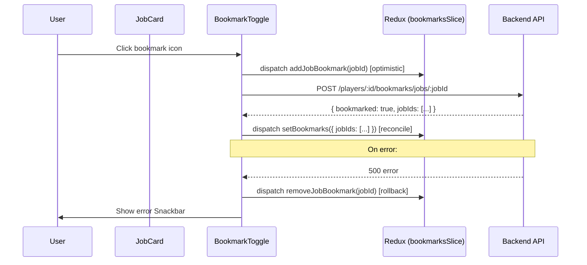
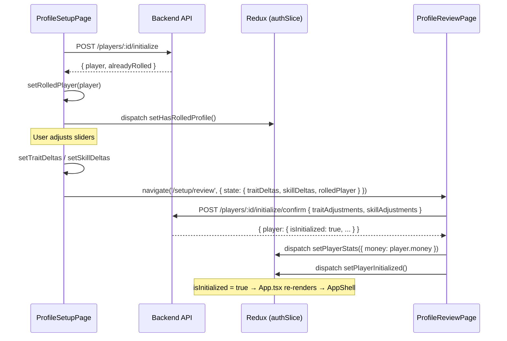

# Design Document: Profile Setup Workflow Redesign

## Overview

This document describes the technical design for replacing the existing single-page `PlayerInitPage` with a guided multi-step profile setup workflow. The redesign introduces a restricted **Setup Shell** that wraps the existing Jobs and Education pages in a read-only browsing mode, adds a bookmark system for players to save jobs and education programs they are interested in, and splits the old init page into a dedicated **Profile Setup Page** (generate + adjust) and a **Review Page** (confirm + submit).

The workflow is free-navigation: players move between the three setup pages (Jobs, Education, Profile Setup) via the restricted nav at their own pace. There is no forced linear progression and no minimum requirements — players can proceed to review without bookmarking anything.

### Key Design Decisions

- **No re-roll**: `POST /players/:id/initialize` is idempotent — it rolls once and returns `alreadyRolled: true` on subsequent calls. The "Generate My Profile" button is disabled after the first roll.
- **Bookmarks persist into normal gameplay**: The bookmark system is not torn down at initialization. Jobs and Education pages gain a "Bookmarked Only" filter toggle in normal gameplay.
- **Setup mode detection via React Context**: A `SetupModeContext` propagates `isSetupMode: boolean` to all child components, avoiding prop-drilling through JobsPage and EducationPage.
- **Adjustment deltas are client-side only until confirm**: The rolled base values are stored on the server after the first roll. Adjustment deltas live in React state on the Profile Setup Page and are only sent to the server at confirm time.
- **Routing strategy**: Setup uses dedicated routes (`/setup/jobs`, `/setup/education`, `/setup/profile`, `/setup/review`) rendered inside `SetupShell`. This avoids contaminating normal gameplay routes with setup-mode detection logic.

---

## Architecture

### Routing Changes in App.tsx

The current `App.tsx` renders `<PlayerInitPage />` for all routes when `!isInitialized`. The redesign replaces this with a `SetupShell` that hosts four sub-routes.

```
token=null          → LoginPage (all routes)
isInGame=false      → LobbyPage (all routes)
isInitialized=false → SetupShell (routes: /setup/jobs, /setup/education, /setup/profile, /setup/review)
                      Any other path → redirect to /setup/jobs
isInitialized=true  → AppShell (normal game routes)
                      Any /setup/* path → redirect to /
```

```mermaid
flowchart TD
    A[App.tsx] --> B{token?}
    B -- no --> C[LoginPage]
    B -- yes --> D{isInGame?}
    D -- no --> E[LobbyPage]
    D -- yes --> F{isInitialized?}
    F -- no --> G[SetupShell]
    G --> H[/setup/jobs → JobsPage setup mode]
    G --> I[/setup/education → EducationPage setup mode]
    G --> J[/setup/profile → ProfileSetupPage]
    G --> K[/setup/review → ProfileReviewPage]
    G --> L[* → redirect /setup/jobs]
    F -- yes --> M[AppShell]
    M --> N[Normal game routes]
    M --> O[/setup/* → redirect /]
```

### Setup Mode Context

A React context carries setup mode state to all descendant components without prop-drilling through page-level components.

```typescript
// frontend/src/contexts/SetupModeContext.tsx
interface SetupModeContextValue {
  isSetupMode: boolean;
}
export const SetupModeContext = createContext<SetupModeContextValue>({ isSetupMode: false });
export const useSetupMode = () => useContext(SetupModeContext);
```

`SetupShell` wraps its children with `<SetupModeContext.Provider value={{ isSetupMode: true }}>`. Normal `AppShell` does not provide this context, so `useSetupMode()` returns `{ isSetupMode: false }` by default.

### High-Level Component Tree (Setup Mode)

```
App.tsx
└── SetupShell
    ├── SetupProgressStepper (persistent top bar)
    ├── SetupModeContext.Provider (isSetupMode: true)
    ├── BookmarksContext.Provider (bookmark state + actions)
    └── Routes
        ├── /setup/jobs      → JobsPage (reads isSetupMode from context)
        ├── /setup/education → EducationPage (reads isSetupMode from context)
        ├── /setup/profile   → ProfileSetupPage
        └── /setup/review    → ProfileReviewPage
```

---

## Components and Interfaces

### New Components

#### `SetupShell`

**File:** `frontend/src/components/layout/SetupShell.tsx`

**Responsibilities:**
- Replaces `AppShell` during the setup workflow
- Renders `SetupProgressStepper` at the top
- Provides `SetupModeContext` and `BookmarksContext` to all children
- Shows only 3 nav items (Jobs, Education, Profile Setup) in a simplified top bar
- Hides all secondary nav (profile drawer, chat, notifications, settings)
- On mobile, renders a bottom nav with the 3 setup items only

**Props:**
```typescript
interface SetupShellProps {
  children: React.ReactNode;
}
```

**Integration:** Rendered by `App.tsx` when `isInitialized === false && isInGame === true`. Wraps the setup sub-routes.

---

#### `SetupProgressStepper`

**File:** `frontend/src/components/layout/SetupProgressStepper.tsx`

**Responsibilities:**
- Displays a horizontal MUI `Stepper` with 3 steps: "Browse Jobs", "Browse Education", "Profile Setup"
- Derives the active step from the current route path (`/setup/jobs` → 0, `/setup/education` → 1, `/setup/profile` or `/setup/review` → 2)
- Each step is clickable and navigates to the corresponding route
- Shows a checkmark on steps the player has "visited" (tracked in local state within `SetupShell`)

**Props:**
```typescript
interface SetupProgressStepperProps {
  activeStep: number; // 0 | 1 | 2
  visitedSteps: Set<number>;
  onStepClick: (step: number) => void;
}
```

**Integration:** Rendered inside `SetupShell` above the page content area.

---

#### `ProfileSetupPage`

**File:** `frontend/src/pages/ProfileSetupPage.tsx`

**Responsibilities:**
- Displays the "Generate My Profile" button (calls `POST /players/:id/initialize`; disabled after first roll)
- Displays "Reset to Rolled Values" button (resets all deltas to zero)
- Renders `TraitSliderRow` and `SkillSliderRow` components (extracted from old `PlayerInitPage`)
- Renders `BudgetMeter` for traits and skills
- Renders `BookmarkedJobsPanel` and `BookmarkedProgramsPanel` showing live eligibility
- "Proceed to Review" button navigates to `/setup/review`; disabled when budget is negative

**Props:** None (reads from Redux `auth` slice and local state)

**Key State:**
```typescript
const [rolledPlayer, setRolledPlayer] = useState<RolledPlayerData | null>(null);
const [traitDeltas, setTraitDeltas] = useState<Record<string, number>>({});
const [skillDeltas, setSkillDeltas] = useState<Record<string, number>>({});
```

`rolledPlayer` is populated on mount by calling `POST /players/:id/initialize` (which returns `alreadyRolled: true` if already rolled). The rolled base values are stored in this state; deltas are applied on top for display and sent to the server only at confirm time.

**Integration:** Rendered at `/setup/profile`. Passes `traitDeltas` and `skillDeltas` to `ProfileReviewPage` via React Router state (`navigate('/setup/review', { state: { traitDeltas, skillDeltas, rolledPlayer } })`).

---

#### `ProfileReviewPage`

**File:** `frontend/src/pages/ProfileReviewPage.tsx`

**Responsibilities:**
- Reads `traitDeltas`, `skillDeltas`, and `rolledPlayer` from React Router location state
- If location state is missing (direct navigation), redirects to `/setup/profile`
- Displays finalized trait and skill values (base + delta)
- Displays starting money, college fund, parent contributions, chronic conditions
- Displays bookmarked jobs and education programs as a summary list
- "Confirm Profile" button calls `POST /players/:id/initialize/confirm`
- On success, dispatches `setPlayerInitialized()` to Redux → `App.tsx` transitions to `AppShell`
- "Back" button returns to `/setup/profile` with state preserved

**Props:** None (reads from router location state and Redux)

**Integration:** Rendered at `/setup/review`. Final step before gameplay begins.

---

#### `BookmarkedJobsPanel`

**File:** `frontend/src/features/bookmarks/BookmarkedJobsPanel.tsx`

**Responsibilities:**
- Reads bookmarked job IDs from `bookmarksSlice`
- Fetches job details for bookmarked IDs from the jobs catalog
- For each bookmarked job, shows title, base salary, requirements, and live eligibility indicator
- Live eligibility is computed client-side by comparing current adjusted traits/skills against job requirements
- Shows empty state with link to `/setup/jobs` when no bookmarks exist

**Props:**
```typescript
interface BookmarkedJobsPanelProps {
  currentTraits: Record<string, number>; // base + deltas
  currentSkills: Record<string, number>; // base + deltas
}
```

---

#### `BookmarkedProgramsPanel`

**File:** `frontend/src/features/bookmarks/BookmarkedProgramsPanel.tsx`

**Responsibilities:** Mirror of `BookmarkedJobsPanel` for education programs.

**Props:**
```typescript
interface BookmarkedProgramsPanelProps {
  currentTraits: Record<string, number>;
  currentSkills: Record<string, number>;
}
```

---

#### `BookmarkToggle`

**File:** `frontend/src/features/bookmarks/BookmarkToggle.tsx`

**Responsibilities:**
- Renders a bookmark icon button (MUI `IconButton` with `BookmarkBorderIcon` / `BookmarkIcon`)
- Calls the appropriate bookmark mutation on click
- Shows loading state during the API call
- Accessible: `aria-label="Bookmark [item name]"` / `aria-label="Remove bookmark for [item name]"`

**Props:**
```typescript
interface BookmarkToggleProps {
  itemId: string;
  itemName: string;
  type: 'job' | 'education';
  isBookmarked: boolean;
  onToggle: (itemId: string, type: 'job' | 'education') => void;
  loading?: boolean;
}
```

---

### Modified Components

#### `App.tsx`

**Changes:**
- Replace the `!isInitialized` branch (which rendered `<PlayerInitPage />`) with `<SetupShell>` containing setup sub-routes
- Add a redirect from `/setup/*` to `/` when `isInitialized === true`
- Remove the `PlayerInitPage` import

```typescript
// Before
if (!isInitialized) {
  return <Routes><Route path="*" element={<PlayerInitPage />} /></Routes>;
}

// After
if (!isInitialized) {
  return (
    <SetupShell>
      <Routes>
        <Route path="/setup/jobs" element={<JobsPage />} />
        <Route path="/setup/education" element={<EducationPage />} />
        <Route path="/setup/profile" element={<ProfileSetupPage />} />
        <Route path="/setup/review" element={<ProfileReviewPage />} />
        <Route path="*" element={<Navigate to="/setup/jobs" replace />} />
      </Routes>
    </SetupShell>
  );
}
// In the isInitialized=true branch, add:
// <Route path="/setup/*" element={<Navigate to="/" replace />} />
```

---

#### `JobCard.tsx`

**Changes:**
- Accept two new optional props: `isBookmarked` and `onBookmarkToggle`
- Accept `isSetupMode` prop (or read from `useSetupMode()` context — context approach preferred to avoid prop-drilling through `JobsPage`)
- In setup mode: hide the `<CardActions>` section containing Apply/Quit buttons
- In both modes: render `<BookmarkToggle>` in the card's top-right badge area when `onBookmarkToggle` is provided

**Updated Props:**
```typescript
interface Props {
  job: JobItem;
  onApply: (jobId: string, partTime: boolean) => void;
  onQuit: (jobId: string) => void;
  applying: boolean;
  quitting: boolean;
  // New
  isBookmarked?: boolean;
  onBookmarkToggle?: (jobId: string) => void;
  bookmarkLoading?: boolean;
}
```

The `isSetupMode` flag is read from `useSetupMode()` context inside the component rather than passed as a prop, keeping the existing call sites in `JobsPage` unchanged for normal gameplay.

---

#### `JobFilters.tsx`

**Changes:**
- Accept new optional prop `showBookmarkedOnly` and `onBookmarkedOnlyChange`
- Render a "Bookmarked Only" `Switch` toggle in the filter panel when these props are provided
- In setup mode (detected via `useSetupMode()`), the `eligibleOnly` switch is hidden and its value is forced to `false` — the filter panel does not render the eligible-only toggle during setup

**Updated Props:**
```typescript
interface Props {
  filters: Filters;
  onChange: (partial: Partial<Filters>) => void;
  onReset: () => void;
  // New
  showBookmarkedOnly?: boolean;
  onBookmarkedOnlyChange?: (value: boolean) => void;
}
```

---

#### `ProgramCard.tsx`

**Changes:** Mirror of `JobCard.tsx` changes.

- Read `isSetupMode` from `useSetupMode()` context
- In setup mode: hide the `<CardActions>` section (Enroll/Drop/ChangeMajor buttons)
- Accept `isBookmarked` and `onBookmarkToggle` props
- Render `<BookmarkToggle>` in the badge area

**Updated Props:**
```typescript
interface Props {
  program: EducationProgram;
  onEnroll: (programId: string, partTime: boolean) => void;
  onChangeMajor: (programId: string) => void;
  onDrop: () => void;
  enrolling: boolean;
  isCurrentProgram: boolean;
  hasActiveEnrollment: boolean;
  // New
  isBookmarked?: boolean;
  onBookmarkToggle?: (programId: string) => void;
  bookmarkLoading?: boolean;
}
```

---

#### `ProgramFilters.tsx`

**Changes:** Mirror of `JobFilters.tsx` changes.

- Accept `showBookmarkedOnly` and `onBookmarkedOnlyChange` props
- In setup mode, hide the `eligibleOnly` toggle and force it to `false`

---

#### `JobsPage.tsx`

**Changes:**
- Read `isSetupMode` from `useSetupMode()` context
- In setup mode:
  - Override `eligibleOnly` filter to `false` on mount (do not persist this override to localStorage)
  - Pass `isBookmarked` and `onBookmarkToggle` to each `JobCard`
  - Pass `showBookmarkedOnly` and `onBookmarkedOnlyChange` to `JobFilters`
  - Show an informational `Alert` banner: "Bookmarks are for planning only — they don't apply for jobs"
  - Show a bookmark count chip in the header
  - Hide the `CurrentEmploymentPanel`
- In normal gameplay mode:
  - Pass `isBookmarked` and `onBookmarkToggle` to each `JobCard` (bookmarks work in both modes)
  - Pass `showBookmarkedOnly` and `onBookmarkedOnlyChange` to `JobFilters`
  - Apply client-side filter: if `showBookmarkedOnly`, only show jobs whose IDs are in the bookmark set

---

#### `EducationPage.tsx`

**Changes:** Mirror of `JobsPage.tsx` changes.

- In setup mode: hide `AcademicProgressPanel`, show informational banner, show bookmark count
- In both modes: pass bookmark props to `ProgramCard` and `ProgramFilters`

---

#### `NavItems.tsx`

**Changes:**
- Export a new `SETUP_NAV_ITEMS` array for use in `SetupShell`

```typescript
export const SETUP_NAV_ITEMS: NavItem[] = [
  { label: 'Seeds to Trees', path: '/setup/jobs', Icon: WorkIcon },
  { label: 'Zest for Learning', path: '/setup/education', Icon: SchoolIcon },
  { label: 'Profile Setup', path: '/setup/profile', Icon: PersonIcon },
];
```

---

## Data Models

### New Redux Slice: `bookmarksSlice`

**File:** `frontend/src/features/bookmarks/bookmarksSlice.ts`

```typescript
interface BookmarksState {
  jobIds: string[];
  programIds: string[];
  loading: boolean;
  error: string | null;
}

const initialState: BookmarksState = {
  jobIds: [],
  programIds: [],
  loading: false,
  error: null,
};
```

**Actions:**
- `setBookmarks(state, action: PayloadAction<{ jobIds: string[]; programIds: string[] }>)` — replaces entire bookmark state (used on initial load)
- `addJobBookmark(state, action: PayloadAction<string>)` — optimistic add
- `removeJobBookmark(state, action: PayloadAction<string>)` — optimistic remove
- `addProgramBookmark(state, action: PayloadAction<string>)` — optimistic add
- `removeProgramBookmark(state, action: PayloadAction<string>)` — optimistic remove

Bookmark mutations use optimistic updates: the Redux state is updated immediately, and the API call runs in the background. On error, the optimistic update is rolled back.

**Selector helpers:**
```typescript
export const selectIsJobBookmarked = (jobId: string) =>
  (state: RootState) => state.bookmarks.jobIds.includes(jobId);

export const selectIsProgramBookmarked = (programId: string) =>
  (state: RootState) => state.bookmarks.programIds.includes(programId);
```

---

### Additions to `authSlice`

**New field:** `hasRolledProfile: boolean` — set to `true` when `POST /players/:id/initialize` returns `alreadyRolled: false` or `alreadyRolled: true` (i.e., any time rolled data is present). This drives the disabled state of the "Generate My Profile" button without requiring a separate API call.

```typescript
// In AuthState
hasRolledProfile: boolean; // default: false

// New action
setHasRolledProfile(state) {
  state.hasRolledProfile = true;
}
```

The `setAuth` action should also accept and set `hasRolledProfile` from the session join response if the server returns it (so page refreshes restore the correct button state).

---

### Database Changes

Two new fields on the `Player` model in `backend/prisma/schema.prisma`:

```prisma
// In model Player
jobBookmarks      String[] @default([])
educationBookmarks String[] @default([])
```

PostgreSQL natively supports `String[]` (text array) via Prisma. This is simpler than JSONB for a flat list of IDs and supports efficient `@> ARRAY[id]` containment queries if needed.

**Migration:** A new Prisma migration adds these two columns with empty array defaults. No data migration is needed — existing players start with empty bookmark arrays.

---

## API Endpoints

### New Endpoints

#### `GET /api/players/:id/bookmarks`

Returns all bookmarks for a player.

**Auth:** `authorize` middleware (player must own the record)

**Response:**
```json
{
  "jobIds": ["job_abc", "job_def"],
  "programIds": ["prog_xyz"]
}
```

**Implementation:** Simple `prisma.player.findUnique` selecting only `jobBookmarks` and `educationBookmarks`.

---

#### `POST /api/players/:id/bookmarks/jobs/:jobId`

Toggles a job bookmark. If the job ID is already in `jobBookmarks`, it is removed. If not, it is added.

**Auth:** `authorize` middleware

**Request body:** None

**Response:**
```json
{
  "bookmarked": true,
  "jobIds": ["job_abc", "job_def"]
}
```

**Implementation:**
```typescript
const player = await prisma.player.findUnique({ where: { id }, select: { jobBookmarks: true } });
const current = player.jobBookmarks as string[];
const isBookmarked = current.includes(jobId);
const updated = isBookmarked
  ? current.filter((id) => id !== jobId)
  : [...current, jobId];
await prisma.player.update({ where: { id }, data: { jobBookmarks: updated } });
```

---

#### `POST /api/players/:id/bookmarks/education/:programId`

Toggles an education program bookmark. Same toggle logic as the jobs endpoint.

**Auth:** `authorize` middleware

**Response:**
```json
{
  "bookmarked": true,
  "programIds": ["prog_xyz"]
}
```

---

### Existing Endpoints (Unchanged)

#### `POST /api/players/:id/initialize`

Already implemented. Returns `{ player, adjustmentBudget, alreadyRolled }`. The `alreadyRolled: true` flag is used by `ProfileSetupPage` to disable the "Generate My Profile" button and restore rolled values without re-rolling.

#### `POST /api/players/:id/initialize/confirm`

Already implemented. Accepts `{ traitAdjustments, skillAdjustments }`, validates budget constraints server-side, applies adjustments, creates vehicle ownership, and sets `isInitialized: true`.

---

## Routing

### Setup Routes

| Route | Component | Notes |
|---|---|---|
| `/setup/jobs` | `JobsPage` (setup mode) | `eligibleOnly` forced off; action buttons hidden; bookmarks shown |
| `/setup/education` | `EducationPage` (setup mode) | Action buttons hidden; bookmarks shown |
| `/setup/profile` | `ProfileSetupPage` | Generate + adjust traits/skills |
| `/setup/review` | `ProfileReviewPage` | Review + confirm; reads state from router location |
| `/setup/*` (catch-all) | `Navigate to="/setup/jobs"` | Redirects unknown setup paths |

### Guard Logic

```typescript
// In App.tsx — setup guard
if (!isInitialized) {
  // All non-setup paths redirect to /setup/jobs
  // /setup/review without rolled data redirects to /setup/profile (handled inside ProfileReviewPage)
}

// In App.tsx — post-init guard
if (isInitialized) {
  // /setup/* paths redirect to /
}
```

### Navigation Within Setup

`SetupShell` renders a simplified top nav bar with only the 3 setup nav items. Clicking a nav item uses React Router `<Link>` to navigate between setup routes. The `SetupProgressStepper` also provides clickable step navigation.

---

## Data Flow

### Bookmark Flow



**Initial load:** When `SetupShell` mounts, it dispatches a React Query fetch for `GET /players/:id/bookmarks` and populates `bookmarksSlice` via `dispatch(setBookmarks(...))`. This ensures bookmarks are restored after a page refresh.

### Rolled Profile Data Flow



### Bookmark Persistence Across Initialization

Bookmarks are stored on the `Player` model as `jobBookmarks String[]` and `educationBookmarks String[]`. The `initialize/confirm` endpoint does not touch these fields — it only updates `traits`, `skills`, and `isInitialized`. Bookmarks therefore survive the transition from setup to normal gameplay automatically.

### Setup Mode Detection Flow

```
SetupShell renders
  └── SetupModeContext.Provider value={{ isSetupMode: true }}
        └── JobsPage
              └── useSetupMode() → { isSetupMode: true }
                    └── JobCard
                          └── useSetupMode() → { isSetupMode: true }
                                → CardActions hidden
                                → BookmarkToggle rendered
```

In normal gameplay, `AppShell` does not provide `SetupModeContext`, so `useSetupMode()` returns `{ isSetupMode: false }` (the context default). No conditional rendering is needed in `AppShell`.

---

## Correctness Properties

*A property is a characteristic or behavior that should hold true across all valid executions of a system — essentially, a formal statement about what the system should do. Properties serve as the bridge between human-readable specifications and machine-verifiable correctness guarantees.*

### Property 1: Routing guard — uninitialized players always land in setup

*For any* route path and any player state where `isInitialized = false` and `isInGame = true`, the routing logic SHALL redirect the player to the Setup Shell (a `/setup/*` route), never to a normal gameplay route.

**Validates: Requirements 1.1**

---

### Property 2: Routing guard — initialized players cannot access setup routes

*For any* `/setup/*` route path and any player state where `isInitialized = true`, the routing logic SHALL redirect the player to the normal game home page (`/`), never rendering any setup component.

**Validates: Requirements 1.2**

---

### Property 3: Setup mode hides action buttons on job cards

*For any* `JobItem` rendered inside a `SetupModeContext` with `isSetupMode = true`, the rendered output SHALL NOT contain Apply or Quit buttons.

**Validates: Requirements 2.2**

---

### Property 4: Setup mode hides action buttons on program cards

*For any* `EducationProgram` rendered inside a `SetupModeContext` with `isSetupMode = true`, the rendered output SHALL NOT contain Enroll, Drop Out, or Change Major buttons.

**Validates: Requirements 3.1**

---

### Property 5: Bookmark toggle round-trip (jobs)

*For any* player and any job ID, toggling the job bookmark ON and then OFF SHALL result in the player's `jobBookmarks` array being identical to its state before either toggle was applied.

**Validates: Requirements 2.4, 2.5, 4.1**

---

### Property 6: Bookmark toggle round-trip (education)

*For any* player and any program ID, toggling the education bookmark ON and then OFF SHALL result in the player's `educationBookmarks` array being identical to its state before either toggle was applied.

**Validates: Requirements 3.3, 3.4, 4.2**

---

### Property 7: Bookmark count display matches bookmark set size

*For any* set of bookmarked job IDs of size N, the bookmark count displayed in the Setup Jobs Page header SHALL equal N.

**Validates: Requirements 2.7**

---

### Property 8: Bookmarked-only filter returns exactly the bookmarked subset

*For any* list of job items and any set of bookmarked job IDs, applying the "Bookmarked Only" filter SHALL return exactly the jobs whose IDs are in the bookmark set — no more, no fewer.

**Validates: Requirements 9.1**

---

### Property 9: Bookmarks survive profile confirmation

*For any* player with a non-empty `jobBookmarks` or `educationBookmarks` array, calling `POST /players/:id/initialize/confirm` SHALL NOT modify the bookmark arrays — they SHALL remain identical before and after the confirm call.

**Validates: Requirements 4.7**

---

### Property 10: Trait budget invariant

*For any* valid set of trait adjustments `{ traitDeltas: Record<string, number> }`, the sum of all positive deltas SHALL be less than or equal to 50 plus the sum of the absolute values of all negative deltas:

```
sum(max(0, delta) for delta in traitDeltas.values())
  ≤ 50 + sum(max(0, -delta) for delta in traitDeltas.values())
```

**Validates: Requirements 6.2, 6.3**

---

### Property 11: Skill budget invariant

*For any* valid set of skill adjustments `{ skillDeltas: Record<string, number> }`, the sum of all positive deltas SHALL be less than or equal to 10 plus the sum of the absolute values of all negative deltas:

```
sum(max(0, delta) for delta in skillDeltas.values())
  ≤ 10 + sum(max(0, -delta) for delta in skillDeltas.values())
```

**Validates: Requirements 6.5, 6.6**

---

### Property 12: Per-trait delta cap

*For any* trait key and any proposed delta, the applied delta SHALL satisfy `|delta| ≤ 10`. No single trait can be adjusted by more than 10 percentage points in either direction from its rolled base value.

**Validates: Requirements 6.1**

---

### Property 13: Per-skill delta cap

*For any* skill key and any proposed delta, the applied delta SHALL satisfy `|delta| ≤ 2`. No single skill can be adjusted by more than 2 points in either direction from its rolled base value.

**Validates: Requirements 6.4**

---

### Property 14: Generate button disabled after roll

*For any* player state where `hasRolledProfile = true`, the "Generate My Profile" button SHALL be disabled (not clickable), regardless of any other UI state.

**Validates: Requirements 5.7, 5.8**

---

### Property 15: Reset to rolled values clears all deltas

*For any* non-empty set of trait and skill deltas, clicking "Reset to Rolled Values" SHALL result in all deltas being set to zero, restoring the trait and skill budget meters to their initial state (traits remaining = 50, skills remaining = 10).

**Validates: Requirements 5.9, 5.10**

---

### Property Reflection

After reviewing the 15 properties above:

- Properties 5 and 6 (bookmark round-trips for jobs and education) are structurally identical but test different data types — both are kept because the implementation has separate code paths.
- Properties 10 and 11 (trait and skill budget invariants) are structurally identical but test different budget constants (50 vs 10) and different delta caps — both are kept.
- Properties 12 and 13 (per-trait and per-skill caps) are structurally identical but test different cap values (±10 vs ±2) — both are kept.
- Property 7 (bookmark count display) is a special case of Property 8 (filter correctness) but tests a different UI element — both are kept.
- Properties 1 and 2 (routing guards) are inverses of each other and test different conditions — both are kept.
- No redundancies identified that warrant consolidation.

---

## Error Handling

### Frontend

| Scenario | Handling |
|---|---|
| `POST /initialize` fails (network error) | Show `Alert` with error message; "Generate My Profile" button re-enabled |
| `POST /initialize/confirm` fails | Show `Alert` on Review Page; "Confirm Profile" button re-enabled |
| Bookmark toggle API call fails | Optimistic update rolled back; show `Snackbar` error toast |
| `GET /bookmarks` fails on mount | Show warning banner; bookmark state defaults to empty arrays |
| Player navigates to `/setup/review` without rolled data | Redirect to `/setup/profile` |
| `isInitialized` becomes `true` mid-session (e.g., another tab confirms) | `App.tsx` re-renders and transitions to `AppShell` automatically |

### Backend

| Scenario | Handling |
|---|---|
| `POST /initialize` called on already-initialized player | Return `400` with `{ error: 'Player has already been initialized' }` |
| `POST /initialize/confirm` with invalid adjustments (budget exceeded) | Return `400` with specific error message |
| `POST /bookmarks/jobs/:jobId` with non-existent job ID | Return `404` |
| Bookmark toggle called by wrong user | Return `403` |
| Database error on bookmark update | Return `500`; client rolls back optimistic update |

---

## Testing Strategy

### Unit Tests

Unit tests cover specific examples, edge cases, and pure logic:

- `SetupProgressStepper`: renders correct active step for each route path
- `SetupShell`: renders only 3 nav items; hides secondary nav
- `JobCard` in setup mode: no Apply/Quit buttons rendered
- `ProgramCard` in setup mode: no Enroll/Drop/ChangeMajor buttons rendered
- `BookmarkToggle`: renders filled icon when `isBookmarked=true`, outline when `false`
- `ProfileSetupPage`: "Generate My Profile" button disabled when `hasRolledProfile=true`
- `ProfileSetupPage`: "Proceed to Review" button disabled when `traitRemaining < 0`
- `ProfileReviewPage`: redirects to `/setup/profile` when location state is missing
- Budget calculation logic (pure functions extracted from `PlayerInitPage`): edge cases at budget boundaries
- `bookmarksSlice` reducers: add, remove, set, rollback

### Property-Based Tests

Property-based tests use [fast-check](https://github.com/dubzzz/fast-check) (already available in the JS ecosystem; no new library needed beyond adding it as a dev dependency).

Each property test runs a minimum of 100 iterations.

**Tag format:** `// Feature: profile-setup-workflow-redesign, Property N: <property text>`

**Property 1 & 2 — Routing guards:**
Generate arbitrary route paths and player auth states. Verify the routing decision function always produces the correct redirect.
```
// Feature: profile-setup-workflow-redesign, Property 1: uninitialized players always land in setup
// Feature: profile-setup-workflow-redesign, Property 2: initialized players cannot access setup routes
```

**Properties 3 & 4 — Setup mode hides action buttons:**
Generate arbitrary `JobItem` and `EducationProgram` objects. Render in setup mode context. Assert no action buttons present.
```
// Feature: profile-setup-workflow-redesign, Property 3: setup mode hides action buttons on job cards
// Feature: profile-setup-workflow-redesign, Property 4: setup mode hides action buttons on program cards
```

**Properties 5 & 6 — Bookmark toggle round-trips:**
Generate arbitrary player IDs and item IDs. Toggle on then off. Assert bookmark array is unchanged.
```
// Feature: profile-setup-workflow-redesign, Property 5: bookmark toggle round-trip (jobs)
// Feature: profile-setup-workflow-redesign, Property 6: bookmark toggle round-trip (education)
```

**Property 8 — Bookmarked-only filter:**
Generate arbitrary job lists and bookmark sets. Apply filter. Assert result equals intersection.
```
// Feature: profile-setup-workflow-redesign, Property 8: bookmarked-only filter returns exactly the bookmarked subset
```

**Properties 10 & 11 — Budget invariants:**
Generate arbitrary trait/skill delta maps (using the same clamping logic as the UI). Assert budget invariant holds.
```
// Feature: profile-setup-workflow-redesign, Property 10: trait budget invariant
// Feature: profile-setup-workflow-redesign, Property 11: skill budget invariant
```

**Properties 12 & 13 — Per-stat delta caps:**
Generate arbitrary proposed deltas. Apply the clamping function. Assert `|result| ≤ cap`.
```
// Feature: profile-setup-workflow-redesign, Property 12: per-trait delta cap
// Feature: profile-setup-workflow-redesign, Property 13: per-skill delta cap
```

**Property 14 — Generate button disabled after roll:**
Generate arbitrary UI states with `hasRolledProfile=true`. Render `ProfileSetupPage`. Assert button is disabled.
```
// Feature: profile-setup-workflow-redesign, Property 14: generate button disabled after roll
```

**Property 15 — Reset clears all deltas:**
Generate arbitrary non-empty delta maps. Apply reset. Assert all values are zero.
```
// Feature: profile-setup-workflow-redesign, Property 15: reset to rolled values clears all deltas
```

### Integration Tests

- `GET /api/players/:id/bookmarks` returns correct bookmark arrays
- `POST /api/players/:id/bookmarks/jobs/:jobId` toggles correctly (add then remove)
- `POST /api/players/:id/bookmarks/education/:programId` toggles correctly
- `POST /api/players/:id/initialize/confirm` does not modify bookmark arrays
- Full setup flow: roll → adjust → confirm → `isInitialized=true` → bookmarks intact
